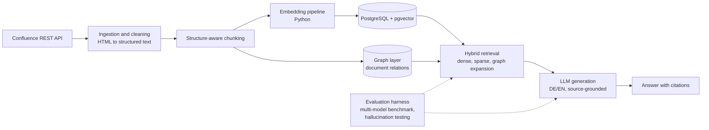

# DB Eddie — RAG Knowledge Assistant (Technical Case Study)

Technical case study of **DB Eddie**, an AI-based knowledge management assistant designed and developed at **Data Business GmbH** (September 2024 – present). The production codebase is proprietary; this repository documents the architecture, engineering decisions, and evaluation methodology.

## Problem

Technical documentation, runbooks, and project knowledge were distributed across a large, growing Confluence space in mixed German and English. Retrieving the correct information required knowing where to look, which cost engineers time and slowed the onboarding of new team members.

**Objective:** an assistant that answers natural-language questions in German or English, grounded in the actual documentation, with source citations — and with measured rather than assumed answer quality.

## Scope of My Work

End-to-end development as AI Application Developer over four-plus months:

- Architecture design (retrieval strategy, storage layer, model selection)
- Ingestion pipeline from Confluence to a queryable knowledge base
- Hybrid retrieval implementation
- Evaluation framework used for production model selection and monitoring
- Iteration based on feedback from the engineering team as users

## Architecture

## Pipeline

**1. Ingestion — Confluence to clean text.** Integration with the Confluence REST API with incremental synchronization (only changed pages are re-processed). Conversion from HTML to structured text preserving headings, tables, and code blocks. Chunk-level metadata (source page, space, last update) is retained for citation and freshness handling.

**2. Storage — PostgreSQL with pgvector.** Embeddings are stored in PostgreSQL using the pgvector extension; the schema is administered via pgAdmin. This was a deliberate decision against a dedicated vector database: one proven system holds both vectors and relational metadata, with no additional infrastructure to operate. A graph layer captures relationships between documents (links, hierarchy) alongside the vector index.

**3. Retrieval — hybrid.** Dense (embedding similarity) and sparse (keyword) retrieval are combined and re-ranked. Graph-aware expansion adds structurally related pages that similarity search alone misses. Chunking follows document structure rather than fixed token windows, which produced a measurable improvement in retrieval quality.

**4. Generation — multilingual and source-grounded.** Queries in German and English operate over the same corpus. Prompting enforces answers grounded in retrieved passages, with citations back to the originating Confluence pages. The model backend is pluggable; the production model is selected based on evaluation results rather than by default.

## Evaluation Framework

- **Multi-model benchmarking:** identical question sets executed against multiple LLM APIs (Anthropic Claude, OpenAI GPT, Google Gemini) and scored on a common rubric
- **Hallucination testing:** answers are systematically checked for faithfulness against the retrieved source passages; unsupported claims are flagged
- **Separation of retrieval and generation evaluation,** so failures can be attributed to retrieval misses versus generation errors
- Benchmark results informed the production model choice and prompt iterations

## Stack

Python · Confluence REST API · PostgreSQL · pgvector · pgAdmin · Anthropic / OpenAI / Google Gemini APIs · embedding pipelines · hybrid dense/sparse/graph retrieval · prompt engineering

## Key Findings

1. Hybrid retrieval outperformed every single-strategy approach on a real, bilingual, heterogeneous corpus — measurably, via the evaluation harness.
2. Chunking strategy affected retrieval quality more than the choice of embedding model. Structure-aware chunking was the largest single improvement.
3. Systematic hallucination testing changed quality discussions from anecdotal to quantitative.
4. PostgreSQL with pgvector was operationally the right choice at this scale compared to a dedicated vector database.
5. Multilingual support (DE/EN) is a first-order requirement in a German engineering organization, not an add-on.

## Author

Aditya Badagandi — M.Sc. Data Science, Berlin; AI Application Developer, Data Business GmbH
Contact: adityabadagandi1397@gmail.com · [LinkedIn](https://linkedin.com/in/adityabadagandi)

Related repositories: [ledgar-clause-classifier](https://github.com/adityabadagandi/ledgar-clause-classifier) · [predictive-maintenance-neural-network](https://github.com/adityabadagandi/predictive-maintenance-neural-network)
